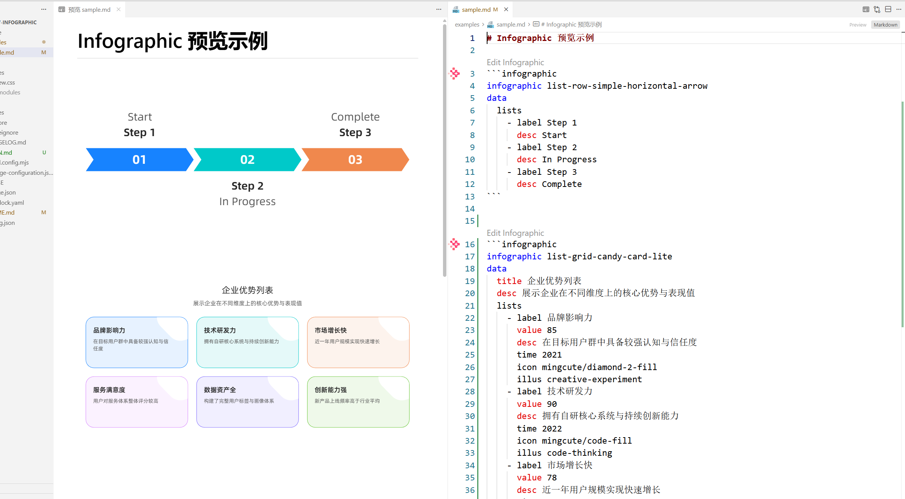

# AntV Infographic Markdown Preview

一个面向 VS Code Markdown 工作流的 Infographic 预览扩展。  
你可以在 Markdown 中直接编写 `infographic` 代码块，并在预览面板中即时看到渲染结果。

## Features

- **Markdown 内嵌支持**：识别 ` ```infographic ` 围栏代码块。
- **实时预览渲染**：在 Markdown Preview 中调用 `@antv/infographic` 渲染 SVG。
- **语法高亮**：为 `infographic` 代码块与 `.infographic` 文件提供语言支持。
- **本地工作流友好**：无需外部服务，直接在 VS Code 中编写和预览。

## Demo



## Usage

在 Markdown 中加入如下代码块：

````markdown
```infographic
infographic list-row-simple-horizontal-arrow
data
  lists
    - label Step 1
      desc Start
    - label Step 2
      desc In Progress
```
````

然后打开 Markdown 预览即可查看渲染结果。  
可直接使用示例文件：`examples/sample.md`。

## Requirements

- VS Code `>= 1.85.0`

## Development

```bash
pnpm install
pnpm run build
pnpm run watch
```

打包扩展：

```bash
pnpm run vsix
```

## Documentation

- 设计与实现细节见：`DESIGN.md`
- 变更记录见：`CHANGELOG.md`

## License

[MIT](LICENSE)
